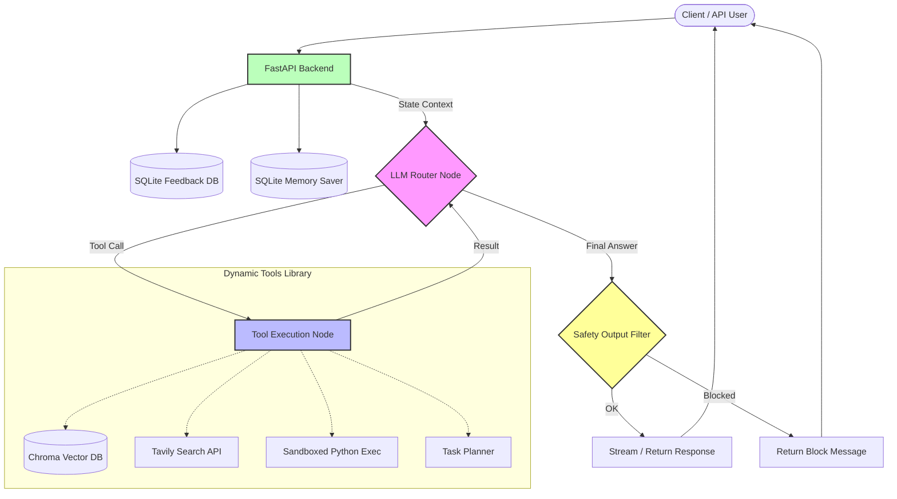

# Enterprise AI Agent Architecture

This document describes the flow of our LangGraph state machine.

## Key Components

1.  **FastAPI Endpoint:** Receives the `/chat` or `/feedback` requests and initializes connection to the LangGraph graph using `thread_id` session memory.
2.  **LLM Router Node (`core/graph.py`):** The primary brain. Prompts the OpenAI model and determines if internal tool execution is necessary.
3.  **Tool Execution Node:** Dynamically loads available python tools from the `tools/` folder. Contains tools for vector storage retrieval, web searching, planning, and executing code snippets.
4.  **Safety System:** Intercepts the final message before it returns to the user to ensure it does not contain restricted content or fail business rules.
5.  **Telemetry & Feedback:** Exposes `/metrics` for Prometheus and stores 5-star conversation RLHF flags in `feedback.db`.
