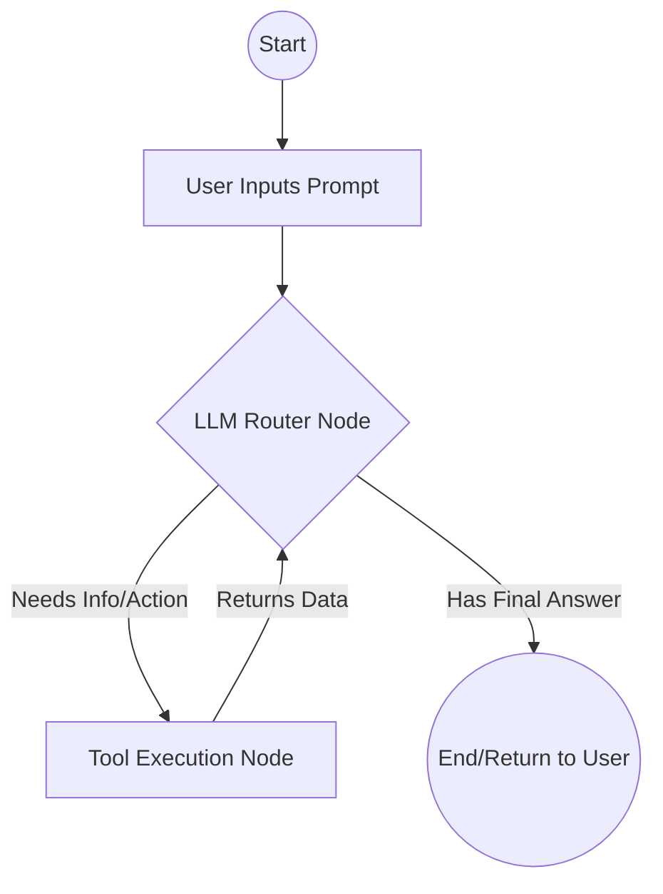

# How Our AI Agent Will Work 🚀

Before we write a single line of code, let's understand exactly *how* this "do-it-all" agent is going to function under the hood using **LangGraph**.

## 1. The Core Concept: The Graph

Imagine a flowchart. That flowchart is exactly how LangGraph works. We are going to build a "Graph" (specifically, a State Graph).

*   **Nodes (The Agents/Workers):** These are python functions. When the flowchart reaches a Node, it does some work. For example, one node might be the "Researcher," another might be the "Coder," and the main one will be the "Router."
*   **Edges (The Connections):** These define how the agent moves from one node to the next.
*   **State (The Memory):** This is a shared scratchpad that travels with the graph. Every node gets to read the State (like the conversation history) and add to it.

## 2. The Basic Architecture

We will start with the most reliable pattern: The **ReAct (Reason and Act)** pattern, orchestrated by a central LLM Router.

Here is the flow of what happens when you type a prompt:

1.  **You type:** *"Find my latest downloaded PDF and summarize it."*
2.  **The LLM Node (Router) thinks:** The LLM looks at your request and looks at a list of "Tools" it has been given. It realizes, "Ah, I need to use the `Read_Local_Files` tool."
3.  **Conditional Edge (The Switch):** The flowchart knows the LLM requested a tool. It takes an edge to the **Tool Node**.
4.  **The Tool Node (Action):** This node actually runs the Python code to read your Downloads folder, parses the PDF, and adds the text of that PDF to the shared *State* memory.
5.  **Back to the LLM:** The flowchart instantly routes *back* to the LLM Node. The LLM now sees the PDF text in the memory state.
6.  **Final Answer:** The LLM says, "I have enough info," writes the summary, and delivers the final answer back to you.

## 3. How We Build It Step-by-Step

To build this massive, capable agent, we are going to do it in modular layers. This way, it never breaks and we can easily add new skills.

### Phase 1: The Brain & The Loop (Foundation)
*   **Create the Environment:** We will set up your Python virtual environment.
*   **Build the Graph Engine:** We will write `graph.py`, which defines the flowchart above (LLM -> Tool -> LLM).
*   **Connect an LLM:** We will connect a model (like OpenAI GPT-4o, Anthropic Claude 3.5, or a local open-source model).
*   **Add a Dummy Tool:** We will give it one simple tool (e.g., a simple Calculator tool) just to prove the loop works.

### Phase 2: Giving It Hands (The Tools)
Once the brain is working, the agent is useless unless it has "Hands" (Tools). To make it "do it all," we simply write python functions and tell the LLM they exist.
*   **File System Tools:** Python scripts to read, write, and search files on your hard drive.
*   **Web Researcher Tools:** Python scripts using `DuckDuckGo` or `Tavily` APIs to search the real-time internet.
*   **Command Line Tools:** (The most powerful) Python scripts that allow the agent to run terminal commands (like `git commit`, `npm install`, or python scripts it wrote itself).

### Phase 3: Giving It A Face (The Interface)
Finally, we need a way for you to talk to it.
*   We will build a simple command-line chat script first.
*   Later, if you want, we can easily add a web interface (using Streamlit or Gradio) so it looks like ChatGPT.

## Summary: Why this is the best way

If you build an agent without a graph, it's just a long script of `if/else` statements that will eventually break.

By building it with **LangGraph**, your agent is a living state machine. If it fails a step, we can tell it to loop back and try again. It's how modern AI startups build their products!
